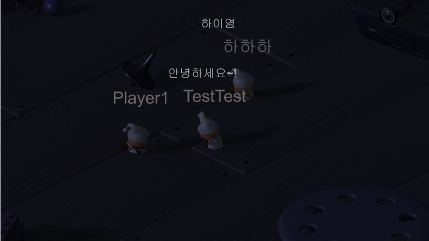

# GameClient

- 개발 환경 : Unity Engine(2017.1.1f1)
 
 
- Unity Engine 튜토리얼의 Survival Shooter 프로젝트를 온라인으로 일부 구현했습니다.
- C#으로 네트워크 모듈을 직접 만들었습니다.
- 패킷 송수신은 별도의 스레드에서 진행 되고 
ServerSession 컴퍼넌트의 Update함수에서 패킷 처리를 합니다.
- 패킷 클레스에 NoobSerializAble 어트리뷰트를 지정하면 자동으로 패킷 송수신 때 시리얼라이징이 됩니다.
- PacketProcRegistration 어트리뷰트로 패킷 처리 함수를 간편하게 지정할 수 있습니다.