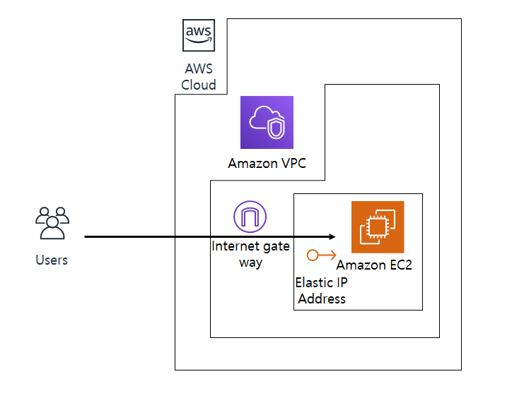

# GameServer
- 개발환경 : Visual Studio 2015
- 개발 언어
    - Game Server : Visual C++ (v142)
    - Packet Generator : C# (.Net 4.5.2)

## NoobBasic
- 서버에 필요한 기초라이브러리들 입니다.
- 싱글톤, 스마트 포인터, 백터와 행렬 등의 자주 사용하는 기능들이 들어있습니다.

## NoobNetwork
- Noob 엔진의 네트워크 레이어 입니다.
- Winsock 라이브러리의 iocp와 비동기 통신 함수들을 사용했습니다.

## GamePacket
- Packet Generator로 만들어진 패킷 모음 입니다.

## GameServer
- 게임 로직이 들어있는 프로젝트 입니다.
- 간단한 유저 관리, 움직임 동기화, 채팅 기능이 있습니다.

## Packet Generator
- 두 언어 간의 원활한 통신을 위해 각각의 언어로 패킷을 만들어주는 툴입니다.
- 중간 언어로 xml을 사용합니다.
- 기본 자료형, 구조체, enum 각종 컨테이너를 패킷에 담을 수 있습니다.
- C# 과 C++ 을 지원합니다.

## AWS
- 현재 Noob Game Server 는 aws에서 동작하고 있습니다.
- 읽기 권한만 가지고 있는 iam 계정으로 구성 환경을 직접 확인하실 수 있습니다.
    - url : https://293419094569.signin.aws.amazon.com/console
    - Id : GuestForInterview
    - Pass : kW=vx2sOiJqE
    - 권한(읽기) : vpc, ec2, s3

